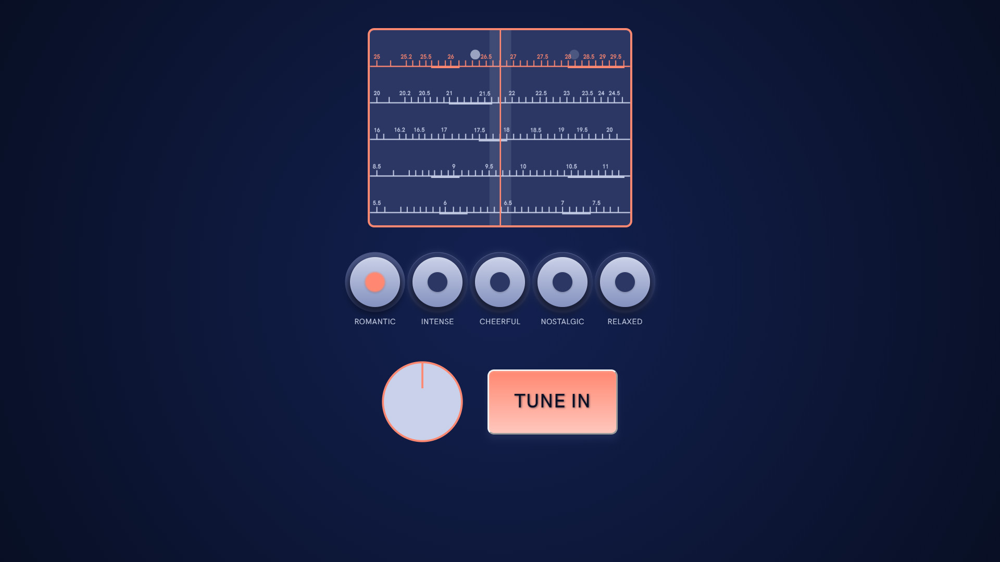

## Table of Contents
1. [Team](#team)
2. [Course reference and academic year](#Course_reference_and_academic_year)
3. [Project Idea](#project-idea)
4. [Design challenges](#Design_challenges)
5. [Code challenges](#Code_challenges)
6. [Inspirations](#Inspirations/References)
7. [Credits](#Credits)

## Team
*VIBE.TUNER* was developed by:
+ [Carlotta Bacchini](https://github.com/carlottabacchini)
+ [Stefano Ferrari](https://github.com/Stefano-Ferrari)
+ [Alessandro Pennacchioni](https://github.com/pennacch)
+ [Raffaele Riccardelli](https://github.com/Raffo98)

## Course reference and academic year
[Creative Coding 2019/2020](https://drawwithcode.github.io/2019/)  
Politecnico di Milano - Scuola del Design  
Faculty: Michele Mauri, Andrea Benedetti

## Project Idea
*VIBE.TUNER* is a web app developed to connect different users around the world through music and feelings. This app has two main features. On one side the user can advise a song which is associated with a mood chosen by the user himself. Once sent, the song is ready to be recommended to another user with the same mood.  
The experience is made more interesting by a visual interface inspired by old radio. The user will interact with knobs and buttons to search on a frequency scale a song he wants to receive as advice.

## Design challenges
First thing first, we wanted to avoid that users just searched for songs that they already knew. So, we decided to keep the search completely random turning it more in an exploration process rather than a simple research. Following the exploration metaphor, we decided to build a small analogue-type experience similar to the one that you can have with an old radio. This was realized with a basic interface composed by buttons and a knob which allow the user to interact with a selector similar to the frequency scale selector.  
Javascript does not provide a simple way to implement a knob-type element, so we decided to rely on a third party [library](https://github.com/eskimoblood/jim-knopf).

The code below regolates the functioning of the song selector in the discovery song phase:
    '''javascript
    s.draw = function() {
      s.imageMode(CENTER);
      s.background('#2c3764');

      //reset the selectorStatus, 0 = no song selected
      var selectorStatus = 0;
      //move the cursor according to the knob slider rotation
      cursorX = s.map(transmissionDegrees, 0, 359, 0, s.width);

      //create selector display with the five radio bars
      for (var i = 0; i < 5; i++) {
        if (moodCategory == i) {
          s.image(scaleArray[i + 5], s.width / 2, s.height / 16 * (2 + (i * 3))+s.height/32, s.width, s.width / 17.5);

        } else {
          s.image(scaleArray[i], s.width / 2, s.height / 16 * (2 + (i * 3))+s.height/32, s.width, s.width / 17.5);

        }

        //if we are in the selected mood
        if (moodCategory == i) {
          //drawing the five radio bar

          //for cycle to go trough the three songs of the selected mood
          for (j = 0; j < 3; j++) {

            //this "if" is needed to wait the foundSongs array to be full
            if (!(foundSongs.length == 0)) {
              //take casual value that was assigned to the song and stored in the found song Array
              var unMappedCasualx = foundSongs[i][j][1];
              //take casualx and convert it to be placed on the bar
              var casualX = s.map(unMappedCasualx, 0, 100, 10, s.width - 10);
              var transp = 255 - 2*Math.abs(casualX - cursorX);
              s.fill(201, 209, 234, transp);

              //when the slider is on an ellipse song (song is selected)
              if (casualX - 10 < cursorX && cursorX < casualX + 10) {
                cursorX = casualX;
                selectorStatus = 1;
                //assign to a global variable the corresponding SPOTIFY URI
                choosenSongUri = foundSongs[i][j][0];
              }

              //drawing the ellipses representing the songs
              s.noStroke();

              s.ellipse(casualX, s.height / 16 * (2 + (i * 3)), s.height / 20);
            }
          }

        }

      }
      //setting the vertical positions hard stop of the selector
      var hardStop = s.height / 16 * (2 + (moodCategory * 3));

      s.rectMode(CENTER);
      s.noStroke();
      s.fill(201, 209, 234, 30);
      s.rect(cursorX, s.height/2, s.width/12, s.height)
      //vertical line
      s.strokeWeight(2);
      s.stroke("#ff8871");
      s.line(cursorX, 0, cursorX, s.height);
      //circle
      s.noFill();

      //transmitt the result of the draw cycle to the global var isButtonChooseSongAbled
      //and able or disable the button
      if (selectorStatus == 1) {
        isButtonChooseSongAbled = 1;
        document.getElementById("receiveSong").classList.remove("inactive");
      } else {
        isButtonChooseSongAbled = 0;
        document.getElementById("receiveSong").classList.add("inactive");
      }

    };

    '''

    

## Code challenges
In order to achieve our goal, it was necessary that the user could search the song he wanted to share inside an already filled out list. The most convenient solution that we came up with was to use an API developed by a musical streaming provider. We decided to use Spotify Web Api because of its popularity and thoroughness of songs and available endpoint.  
We quickly realized that we had not enough knowledge to use an API in plain javascript. Luckily we found a [library](https://github.com/thelinmichael/spotify-web-api-node) that simplified the communication between our server and the API. Spotify grants access to a lot of data, but we decided to only ask for the song's ID and URI. This allowed us to avoid the user's login, simplifying and reducing data storage.
This was made possible thanks to the iFrame provided by Spotify, containing all the information we needed (album cover, artist name, audio preview, etc.) but requiring only the song's URI.  
As we previously said, it was necessary store all the song's IDs and URIs to create a library of suggested songs. For this purpose, we used Firebase, a framework provided by Google that also gives access to a Realtime Database. Firebase is not an actual database, because it is not possible to make SQL queries, instead you can communicate with the database with a syntax similar to javascript object's one. Its realtime feature allowed us to test the code in an easier and quicker way.  
During the developing phase of the project we used node.js to test the client-server connection. Later, when we uploaded it on Heroku, we decided to keep using the node modules, because of its compatibility with the Spotify web API library and Heroku itself.

## Inspirations
Our main inspirations come from the analogue world, that our generation has never fully experienced. We thought about the period of free radios in Italy, when everyone could broadcast his own transmission. Talking of the radio world, it was immediate to think of one of the most famous design of a radio: the Braun T1000, designed by Dieter Rams in 1963.

## Credits
*VIBE.TUNER* was designed with the following third party libraries and tools:
+ [p5.js](https://p5js.org/)
+ [node.js and node modules](https://nodejs.org/it/)
+ [socket.IO](https://socket.io/)
+ [spotify Web Api](https://developer.spotify.com/documentation/web-api/)
+ [spotify-web-api-node](https://github.com/thelinmichael/spotify-web-api-node)
+ [Firebase database](https://firebase.google.com/docs/database)
+ [dotenv](https://github.com/motdotla/dotenv)
+ [Jim Knopf (Knob.js)](https://github.com/eskimoblood/jim-knopf)
